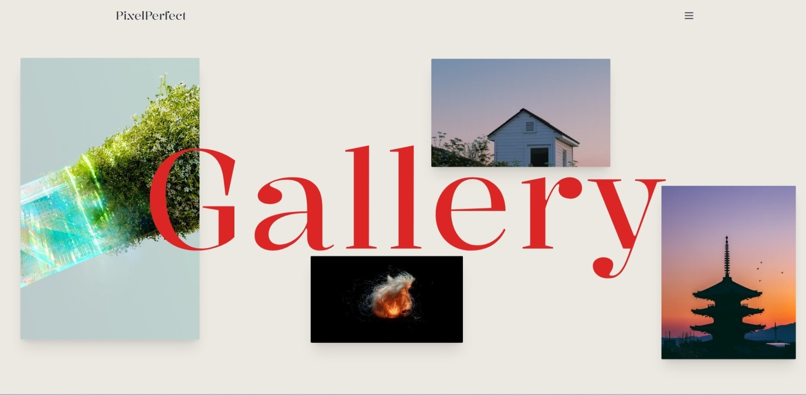

# Image Gallery App

Welcome to the Image Gallery App, a modern web application that showcases stunning photography using the Unsplash API. Built with React, Tailwind CSS, Framer Motion, and GSAP, this app delivers a smooth and visually appealing experience for users to explore and enjoy beautiful images.

## Features

- **Responsive Design:** Built with Tailwind CSS for a seamless experience on any device.
- **Dynamic Image Fetching:** Utilizes the Unsplash API to fetch a variety of high-quality images.
- **Smooth Animations:** Enhanced with Framer Motion and GSAP for eye-catching animations and transitions.
- **Image Grid Display:** Displays a grid of images with smooth loading and error handling.
- **Image Slider:** Showcases a selection of featured images in a slider format.
- **Floating Component:** Includes an interactive floating component for enhanced user interaction.
- **Collection Section:** Features curated collections of images with thematic focus.
- **Photography Tips:** Provides helpful tips for photography enthusiasts.
- **Feature Showcase:** Highlights the unique features of the gallery app.

## Live Demo

Check out the live version of the project [here](https://pixel-perfect-tau.vercel.app/).

## Installation

1. **Clone the repository:**

   ```bash
   git clone https://github.com/Prateeksingchn/gallery-app
   cd image-gallery-app
   ```

2. **Install the dependencies:**

   ```bash
   npm install
   ```

3. **Set up the Unsplash API:**

   - Create a `.env` file in the root directory.
   - Add your Unsplash API key:

     ```bash
     VITE_UNSPLASH_API_KEY=your_unsplash_api_key
     ```

4. **Run the app:**

   ```bash
   npm run dev
   ```

5. **Build the app for production:**

   ```bash
   npm run build
   ```

## Usage

- **Home Page:** The home page features a dynamic image slider, curated collections, photography tips, and a grid of images fetched from the Unsplash API.
- **Error Handling:** If the images fail to load, an error message is displayed with a prompt to try again later.

## Screenshots





## Contributing

Contributions are welcome! If you would like to contribute to the project, please fork the repository and submit a pull request.

## License

This project is licensed under the MIT License. See the [LICENSE](LICENSE) file for details.

## Acknowledgments

- [Unsplash](https://unsplash.com) for the amazing photography API.
- [React](https://reactjs.org) for the robust framework.
- [Tailwind CSS](https://tailwindcss.com) for the utility-first CSS framework.
- [Framer Motion](https://www.framer.com/motion/) for the powerful animation library.
- [GSAP](https://greensock.com/gsap/) for the industry-standard animation tool.

---

Happy Coding! 🚀
```
